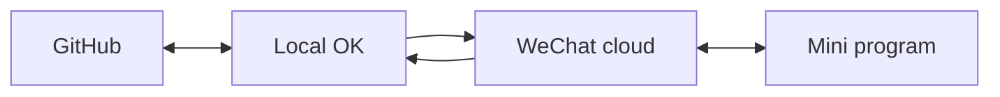

# 知识库云地同步方案（OpenKnowledge 原生 git 同步）

## 决策摘要（2026-10-04 与用户确认）

- **同步主干**：OpenKnowledge 原生 git 同步（GitHub 远端），不自建服务器、不备案。
- **本地多人形态**：混合 —— 部分成员本机装 OpenKnowledge（各自 pull/push），部分成员仅用云端（小程序）。
- **实时性**：最终一致即可（打开 / 手动 / 定时同步），不要求 CRDT 实时同编。
- **四面都要能同步**（同日补充）：Git 端、个人本地 OK 端、小程序云端、小程序个人端，数据都要能收敛到同一套事实，而不是只通其中两头。

> 此组合零自建服务器，正好绕开 [App 数据同步方案](./app-sync-plan.md) 中已规避的「部署公网 + 备案」最高成本项。

## 四面同步（目标与分工）

四面不是互相直连成网，而是两条边拼成闭环。任一端写入后，沿环走一圈，另外三端都能读到对应数据。细节见 [App 数据同步方案](./app-sync-plan.md) 与桥接文件 [app-sync.md](../app-sync.md)。



| 端 | 角色 | 读什么 | 写什么 |
| --- | --- | --- | --- |
| Git 端 | 知识库 markdown 的远端事实源 | 全库 `.md` / `.ok` | `ok sync` / `git push` |
| 个人本地 OK 端 | 编辑器 + 桥 | Git 拉下来的库，加 [app-sync.md](../app-sync.md) | 改档案后 `ok sync`；导出 `kb.json`；拉取云端运营数据覆盖 `app-sync.md` |
| 小程序云端 | 手机侧的事实源 | `kb.json`、`kb_meta`、`hh_growth` / `checkins` | 上传 `kb.json`；集合写入 |
| 小程序个人端 | 家人手机上的 App | 启动时拉云端 `kb.json` + 自己的打卡 | 待办 / 笔记 / 打卡先写云数据库 |

三类数据不要混成一份互相覆盖的 JSON：

1. **档案内容**（成长计划、课表、约定）：事实源是 Git / 本地 OK。下行到小程序：本机 `export.mjs` 生成 `kb.json`，上传云存储，个人端按 `kb_meta` 下载。
2. **家庭共享运营**（小程序里新建的待办、笔记、习惯摘要）：事实源是微信云库。上行到 Git / OK：导出覆盖 [app-sync.md](../app-sync.md)（勿手改），再 `ok sync`。
3. **个人打卡**（按 openid 隔离）：事实源是云数据库 `checkins` 与该用户的小程序端。不把个人勾选直接改写别人的 `growth` 文档。家庭只在 `app-sync.md` 里看摘要（如打卡天数）。

> [!IMPORTANT]
> 小程序个人端不能直连 GitHub 或本机 OpenKnowledge（`ok start` 是 localhost）。个人端只跟小程序云端说话。Git 与手机之间必须经过本地 OK 这座桥。

闭环要跑通，负责人机每次（或定时）做完这四步，四面才齐：

1. `ok sync`（Git 与本地 OK 互相同步）
2. `node scripts/export.mjs` 并把 `kb.json` 上传云存储、更新 `kb_meta`（OK 下行到云端，下次打开的个人端能拉到）
3. `npm run sync:kb:pull`（或等价导出）覆盖 `app-sync.md`（云端上行到本地 OK）
4. 再 `ok sync`（本地 OK 推回 Git）

缺任一步，就会出现 Git 上有新计划但手机还是旧的，或手机写了笔记但 OK / Git 没有。

## 总体拓扑

```
                   GitHub 远端（单一事实源）
          鸭仔一家人 KB 的 markdown + .ok 配置/schema
                        ▲   ▲
              ok sync   │   │      ok sync
              (pull/push)│   │      (pull/push)
                        │   │
          ┌─────────────┘   └─────────────┐
          │                               │
    本地 OpenKnowledge 实例          本地 OpenKnowledge 实例
    （你 / 装了 OK 的家人）        （其他装了 OK 的家人）
          │
          │ 谁持有最新本地副本，谁负责 export.mjs → kb.json → 微信云存储
          ▼
    微信小程序 hh-growth-app ── 运营数据 ──▶ 微信云开发 hh_growth 集合
                                                │
                                      app-sync.md 桥接（半自动回写）
                                                │
                                                ▼
                                      合并回 GitHub 远端 KB
```

要点：

- **云端 = GitHub 远端**，不是微信云开发。微信云开发只承载小程序运营数据（打卡 / 待办 / 笔记），并经 `app-sync.md` 桥接回知识库（见 [App 数据同步方案](./app-sync-plan.md)）。
- **本地多人 = 多个 OpenKnowledge 实例各自 `ok sync` 到同一 GitHub 远端**；仅用云端的成员经小程序写入，数据经 `hh_growth` → `app-sync.md` 回到 KB。

## 两条同步边

### 边 A：本地 OK ↔ GitHub（本次重点，OpenKnowledge 原生）

- 命令：`ok sync` = commit + pull + push 一体（已含 pull-before-push，降低冲突）。
- 认证：`ok auth login`（GitHub Device Flow；当前状态：✓ Logged in as uishow）。
- 运行态已隔离：OpenKnowledge 自带 `.ok/.gitignore` 已忽略 `.ok/local/`（锁文件 / 缓存 / 日志 / telemetry），不会跨机冲突。

### 边 B：KB ↔ 小程序（既有方案）

- 内容热更新：`export.mjs` 生成 `kb.json` → 上传云存储 + `kb_meta` 版本比对（见 app-sync-plan.md 链路 2）。
- 运营回写：小程序打卡 / 笔记 → `hh_growth` 集合 → 自动生成 `app-sync.md`（根目录桥接文件，勿手改）。

## 前置条件 / 环境依赖

- 已安装 OpenKnowledge 桌面端（提供 `ok` CLI）。
- 已 `ok auth login`（当前：✓ uishow 已登录）。
- 需要一个 **GitHub 仓库**作为远端（见下，用户侧创建）。
- 根 `.gitignore` 已增补 `.claude/`、`.codex/`、`.cursor/`，避免本地 AI 编辑器配置进入共享仓库。

## 分步设置清单

> 标注 **[需你执行]** 的为外部动作（创建仓库 / 授权），本会话不会擅自操作。

1. **[需你执行] 创建 GitHub 远端仓库**（建议私有 + 邀请家人协作者）
   - 网页：github.com → New repository，命名如 `ya-zai-yi-jia-ren`，Private，不初始化 README/.gitignore（避免与本地冲突）。
   - 或 `gh repo create uishow/ya-zai-yi-jia-ren --private`（需 `gh` CLI 登录）。
2. **[需你执行] 本机 KB 目录关联远端**
   ```bash
   cd "/Users/beryllewis/Documents/OpenKnowledge/鸭仔一家人"
   git remote add origin https://github.com/uishow/ya-zai-yi-jia-ren.git
   ```
3. **[需你执行 / 我可代跑] 首次同步（推送初始内容）**
   ```bash
   ok sync
   ```
   首次会 commit 全部 KB 内容（`.ok/local/` 已被忽略），pull（空）→ push 到 origin。
4. **其他本地 OK 成员接入**
   ```bash
   git clone https://github.com/uishow/ya-zai-yi-jia-ren.git
   cd ya-zai-yi-jia-ren && ok auth login && ok sync
   ```
5. **仅用云端的成员**：经小程序操作，数据经 `hh_growth` → `app-sync.md` 回流；本地 OK 成员下次 `ok sync` 即可拉到。

## 日常使用

- 编辑前建议先 `ok sync`（拉取他人最新改动），编辑后 `ok sync`（提交并推送）。
- 频率：打开项目时 / 完成一组编辑后。家庭低频场景，手动或每日一次足够。
- 可选自动化：用 cron / launchd 周期性 `ok sync`（如每 30 分钟），进一步逼近「准实时」。**非必需**，按需再加。

## 冲突处理

- `ok sync` 已内含 pull-before-push；两人改同一文件不同处，git 自动合并。
- 同一行冲突时 git 报 conflict，需手动解冲突后再次 `ok sync`。
- 降低冲突实践：编辑前先 sync；大段改动先在家庭群 / 小程序里沟通。
- `app-sync.md` 为自动生成桥接文件，由小程序导出方维护，其他人只 pull 不手改，避免回写冲突。

## 与 hh-growth-app 的衔接

- `kb.json` 由**持有最新本地副本**的一方执行 `scripts/export.mjs` 生成并上传云存储（app-sync-plan.md 链路 2）。
- 建议约定：KB 内容更新 → `ok sync` 推送 → 由固定负责人（你）导出并上传，避免多人重复导出互相覆盖。

## 风险与注意

- 不手改 `app-sync.md` 与 `.ok/local/`。
- 仓库设为 Private，只邀请可信家人作协作者。
- 换机器：先 `git clone` + `ok auth login` 再 `ok sync`，勿直接拷贝 `.ok/local/`。
- 当前 `ok sync` 依赖 git remote 存在；远端未建前执行会失败（预期内）。

日常逐步命令、路径、排错见 [四面同步操作手册](./kb-sync-playbook.md)。Git 远端已是 `https://github.com/uishow/hh-konwledge-base.git`。

## 相关

- [四面同步操作手册](./kb-sync-playbook.md)
- [App 数据同步方案](./app-sync-plan.md)
- [App 构建方案（PC 网页 + 微信小程序）](./app-build-plan.md)
- [App 源码（导出 / 读取层 / 页面）](./app-source.md)
